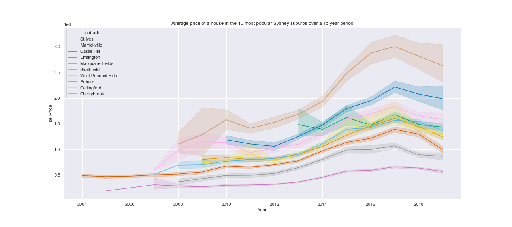

# Price prediction and Trend analysis of the real estate market in Sydney from 2000-2019: Project overview

- Created a tool that predicts house prices given the number of beds, bathrooms, cars and location desired. Thanks to this tool, housebuyers/real estate investors will be able to make better decisions. 
- Acquired and cleaned a 200k rows dataset from Kaggle.
- Compared Linear, Lasso, decision tree and XGBRegressor to reach the best model.
- Deployed the model to production using Flask and AWS

## Code and Resources used
Python version: 3.8.8    
Packages: pandas, numpy, sklearn, xgboost, missingno, matplotlib, seaborn, flask, json, pickle    
For Web app requirements:
```
pip install -r requirements.txt
```
Dataset used: [Sydney house price](https://www.kaggle.com/mihirhalai/sydney-house-prices)

## Data Cleaning
After obtaining the data, I cleaned it so that I could use it to build our model. I made the following changes:
- Changed the date column format to datetime, split it, and kept only the Year and Month columns.
- Dropped the Id, postalCode and Month columns.
- Removed outliers.
- Built a new DataFrame with House as the only property type, and kept the last two years as well as the 100 most popular suburbs.

## EDA
I looked at the distribution of each property type as well as the price trend over the years. Here are a few samples:
    


